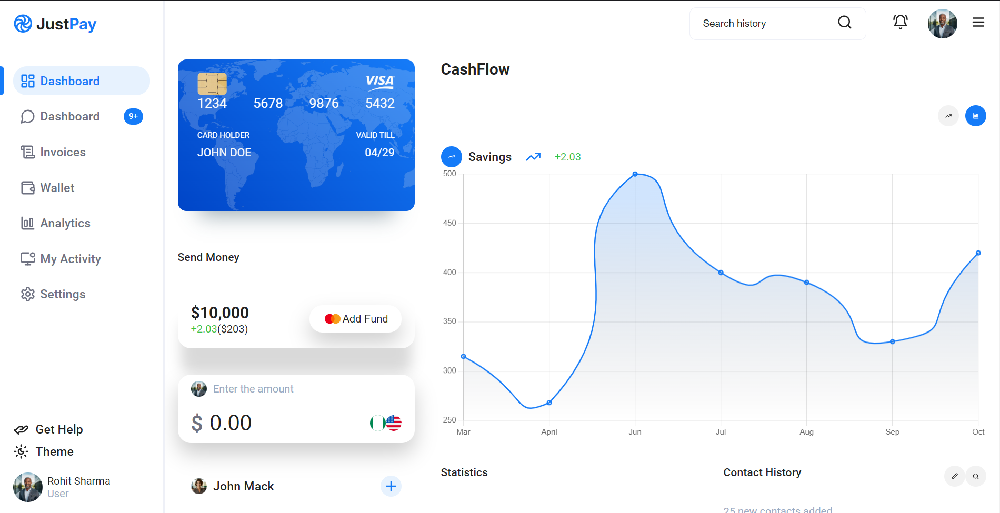

# JustPay - Fintech Dashboard Application

JustPay is a simple fintech dashboard application built with **React** and **Chart.js**. It provides a user-friendly interface to display financial data in a visually engaging manner. This project is designed with both light and dark themes to suit user preferences.

## Table of Contents
- [Screenshots](#screenshots)
- [Features](#features)
- [Technologies Used](#technologies-used)
- [Getting Started](#getting-started)
- [Available Scripts](#available-scripts)
- [License](#license)

## Screenshots

### Light Theme



### Dark Theme


## Features
- Interactive charts powered by **Chart.js**
- Light and dark theme modes
- Responsive design for different screen sizes

## Technologies Used
- **React**: Frontend library for building user interfaces
- **Chart.js**: For rendering charts and graphs
- **Lucide React**: Icon set for modern web applications
- **Vite**: Lightning-fast development build tool

## Getting Started

To run this project locally, follow these steps:

1. Clone the repository:
   ```bash
   git clone https://github.com/iiharsha/justpay
   cd justpay
   ```

2. Install the dependencies:
   ```bash
   npm install
   ```

3. Start the development server:
   ```bash
   npm run dev
   ```

4. Open your browser and navigate to:
   ```
   http://localhost:5173
   ```

## Available Scripts

In the project directory, you can run:

- **`npm run dev`**: Starts the development server.
- **`npm run build`**: Builds the project for production.
- **`npm run lint`**: Lints the project for code errors.
- **`npm run preview`**: Previews the production build locally.
- **`npm run format`**: Formats the code using Prettier.